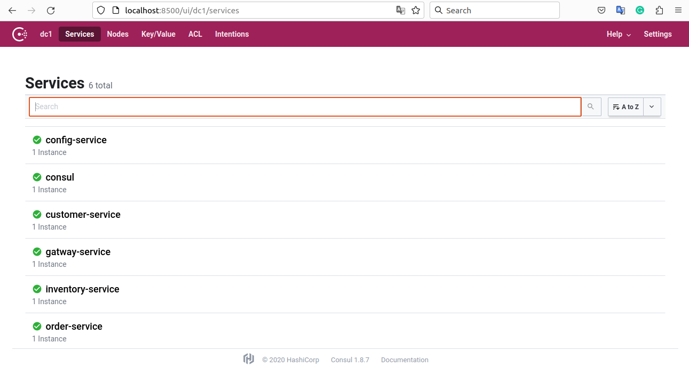
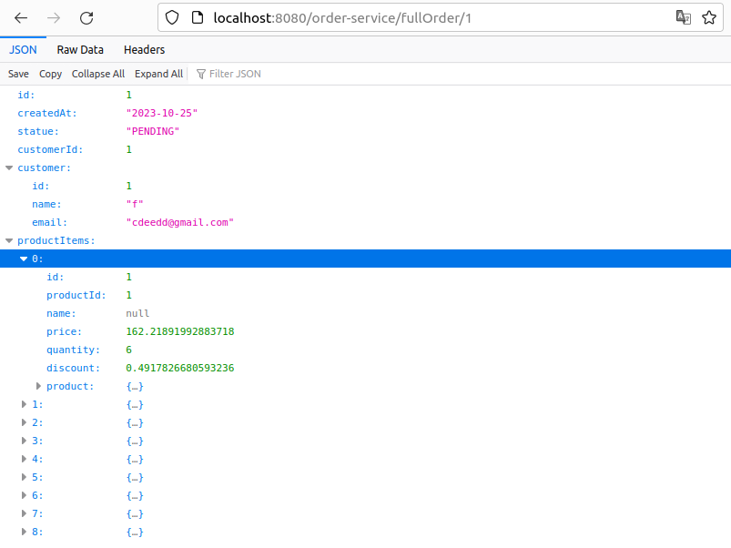

# Microservices Architecture with Spring Cloud

1. Inventory Service
2. Customer Service
3. Order Service
4. Gatway Service
5. Consul Service
6. Config Service
7. Logging Feign clients (monitor and diagnose the interactions between their application)
8. Front-end Service (angular)

## Screenshots

### that means all microservices work 100% fine because they retrieve product information from the inventory and customer information from the customer-service
