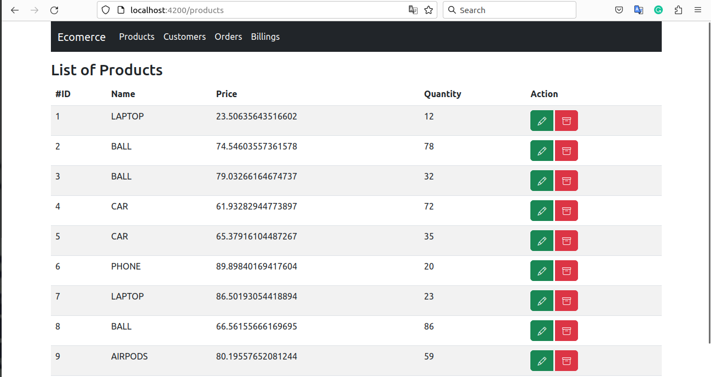

# Microservices Architecture with Spring Cloud

1. Inventory Service
2. Customer Service
3. Order Service
4. Gatway Service
5. Consul Service (Service Discovery)
6. Config Service (Spring Cloud Config)
7. Logging Feign clients (monitor and diagnose the interactions between microservices )
8. Front-end Service (angular)
9. Billing Service with vault -> HashiCorp ( Secrets management )

## Screenshots

### that means all microservices work 100% fine because they retrieve product information from the inventory and customer information from the customer-service

